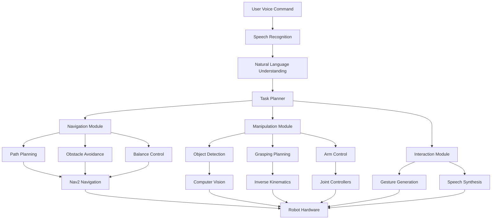

# چیپٹر 16: کیپسٹون پروجیکٹ - خود مختار انسان نما

## سیکھنے کے اہداف
- تمام پہلے سے سیکھے گئے مفادات کو ایک مکمل خود مختار انسان نما سسٹم میں ضم کرنا
- ROS 2، Isaac Sim، Nav2، اور GPT ماڈلز کا انضمام
- انسان نما روبوٹ کے لیے مکمل کنٹرول اور تاثر سسٹم کو لاگو کرنا
- صارف کے کمانڈز کو قبول کرنے، راستے کا منصوبہ بندی کرنے، رکاوٹوں سے گزرنے، اشیاء کی شناخت کرنے، اور اشیاء کو ہیرا پھیری کرنے کے لیے ایک مکمل سسٹم تیار کرنا

## کیپسٹون پروجیکٹ کا جائزہ

### کیا کیپسٹون پروجیکٹ ہے؟

کیپسٹون پروجیکٹ اس کورس کا اختتامی پروجیکٹ ہے جو تمام سیکھے گئے مفادات کو ایک مکمل، خود مختار انسان نما روبوٹ میں ضم کرتا ہے۔ یہ پروجیکٹ مندرجہ ذیل اہلیتوں کا مظاہرہ کرتا ہے:

1. **Speech Recognition**: صارف کے وائس کمانڈز کو سمجھنا
2. **Natural Language Understanding**: کمانڈز کا مطلب سمجھنا
3. **Path Planning**: منزل تک جانے کا راستہ تلاش کرنا
4. **Navigation**: رکاوٹوں سے بچنا اور منزل تک پہنچنا
5. **Object Detection**: اشیاء کی شناخت
6. **Manipulation**: اشیاء کو تھامنا اور ہیرا پھیری کرنا
7. **Human-Robot Interaction**: قدرتی تعامل

### کیپسٹون سسٹم کی خصوصیات

- **Autonomous**: کوئی انسانی مداخلت کی ضرورت نہیں
- **Multimodal**: گفتگو، ویژن، ہاتھ
- **Interactive**: انسانوں کے ساتھ تعامل
- **Adaptive**: ماحول کے مطابق ایڈجسٹ
- **Safe**: محفوظ کارروائی

## کیپسٹون سسٹم کی آرکیٹیکچر

### سسٹم کے اجزاء



### ROS 2 میں سسٹم کا انضمام

```python
from rclpy.node import Node
from std_msgs.msg import String
from sensor_msgs.msg import Image, JointState, LaserScan
from geometry_msgs.msg import Twist, PoseStamped
from nav_msgs.msg import Odometry
import numpy as np
import openai
import speech_recognition as sr
import pyttsx3
import json
import threading
import queue

class AutonomousHumanoidNode(Node):
    def __init__(self):
        super().__init__('autonomous_humanoid')

        # سینسرز کے لیے سبسکرائبرز
        self.image_sub = self.create_subscription(Image, '/camera/image_raw', self.image_callback, 10)
        self.laser_sub = self.create_subscription(LaserScan, '/scan', self.laser_callback, 10)
        self.odom_sub = self.create_subscription(Odometry, '/odom', self.odom_callback, 10)
        self.joint_state_sub = self.create_subscription(JointState, '/joint_states', self.joint_state_callback, 10)

        # کمانڈز کے لیے پبلشرز
        self.cmd_vel_pub = self.create_publisher(Twist, '/cmd_vel', 10)
        self.speech_pub = self.create_publisher(String, '/robot_speech', 10)
        self.navigation_goal_pub = self.create_publisher(PoseStamped, '/goal_pose', 10)
        self.manipulation_cmd_pub = self.create_publisher(String, '/manipulation_commands', 10)

        # وائس کمانڈز کے لیے سبسکرائبرز
        self.voice_cmd_sub = self.create_subscription(String, '/voice_commands', self.voice_command_callback, 10)

        # سسٹم کی حالت
        self.system_state = 'idle'  # idle, listening, processing, executing, navigating, manipulating
        self.current_pose = None
        self.current_joint_states = None
        self.latest_image = None
        self.laser_data = None

        # سسٹم ماڈیولز
        self.speech_recognizer = sr.Recognizer()
        self.speech_synthesizer = pyttsx3.init()
        self.task_planner = TaskPlanner()
        self.navigation_system = NavigationSystem()
        self.manipulation_system = ManipulationSystem()
        self.vision_system = VisionSystem()

        # کمانڈ کی قطار
        self.command_queue = queue.Queue()

        # ٹاسک کی تاریخ
        self.task_history = []

        # اسپیچ ریکوگنیشن کے لیے مائیکروفون
        self.microphone = sr.Microphone()

        # کنٹرول ٹائمر
        self.control_timer = self.create_timer(0.1, self.control_loop)

    def control_loop(self):
        """مرکزی کنٹرول لوپ"""
        if self.system_state == 'idle':
            # چیک کریں کہ کیا کوئی کمانڈ ہے
            if not self.command_queue.empty():
                command = self.command_queue.get()
                self.process_command(command)

        elif self.system_state == 'executing':
            # جاری کام کی نگرانی کریں
            self.monitor_task_execution()

        elif self.system_state == 'navigating':
            # نیوی گیشن کی نگرانی کریں
            self.monitor_navigation()

        elif self.system_state == 'manipulating':
            # مینوپولیشن کی نگرانی کریں
            self.monitor_manipulation()

    def voice_command_callback(self, msg):
        """وائس کمانڈ کو ہینڈل کریں"""
        command_text = msg.data
        self.get_logger().info(f'وائس کمانڈ موصول: {command_text}')

        # کمانڈ کو قطار میں شامل کریں
        self.command_queue.put(command_text)

        # سسٹم کو کمانڈ کی حالت میں تبدیل کریں
        self.system_state = 'processing'

    def process_command(self, command_text):
        """کمانڈ کو پروسیس کریں"""
        try:
            # کمانڈ کو سمجھیں
            parsed_command = self.parse_command(command_text)

            if parsed_command:
                # کام کا منصوبہ بنائیں
                task_plan = self.task_planner.create_plan(parsed_command)

                if task_plan:
                    # کام شروع کریں
                    self.execute_task_plan(task_plan)
                else:
                    # غلط کمانڈ کے لیے ناکامی کا جواب دیں
                    self.speak_response("میں آپ کے کمانڈ کو نہیں سمجھ سکا۔ براہ کرم دوبارہ کہیں۔")
                    self.system_state = 'idle'
            else:
                self.speak_response("کمانڈ کو سمجھنا ممکن نہیں تھا۔")
                self.system_state = 'idle'

        except Exception as e:
            self.get_logger().error(f'کمانڈ پروسیسنگ میں خرابی: {e}')
            self.speak_response("کمانڈ پروسیسنگ میں خرابی ہوئی۔")
            self.system_state = 'idle'

    def parse_command(self, command_text):
        """کمانڈ کو پارس کریں"""
        # کمانڈ کو سمجھنے کے لیے GPT ماڈل کا استعمال کریں
        try:
            prompt = f"""
            مندرجہ ذیل کمانڈ کو سمجھیں اور JSON فارمیٹ میں واپس کریں:

            کمانڈ: {command_text}

            جواب (JSON فارمیٹ میں، صرف JSON دیں):
            {{
                "action": "move_to | pick_up | put_down | follow | greet | etc",
                "target": "object_name | location | person | etc",
                "parameters": {{
                    "x": number,
                    "y": number,
                    "z": number,
                    "object": "object_name"
                }}
            }}
            """

            response = openai.ChatCompletion.create(
                model="gpt-3.5-turbo",
                messages=[{"role": "user", "content": prompt}],
                temperature=0.1
            )

            parsed_result = json.loads(response.choices[0].message.content)
            return parsed_result

        except Exception as e:
            self.get_logger().error(f'کمانڈ کو سمجھنے میں خرابی: {e}')
            return None

    def execute_task_plan(self, task_plan):
        """ٹاسک منصوبہ انجام دیں"""
        self.get_logger().info(f'ٹاسک منصوبہ انجام دیا جا رہا ہے: {task_plan}')

        action = task_plan.get('action', '')
        target = task_plan.get('target', '')
        params = task_plan.get('parameters', {})

        if action == 'move_to':
            self.execute_navigation_task(target, params)
        elif action == 'pick_up':
            self.execute_manipulation_task('pick_up', target, params)
        elif action == 'put_down':
            self.execute_manipulation_task('put_down', target, params)
        elif action == 'follow':
            self.execute_follow_task(target)
        elif action == 'greet':
            self.execute_greeting_task(target)
        else:
            self.speak_response(f"میں {action} کرنا نہیں جانتا۔")
            self.system_state = 'idle'

    def execute_navigation_task(self, target, params):
        """نیوی گیشن ٹاسک انجام دیں"""
        self.get_logger().info(f'نیوی گیشن ٹاسک: {target} کی طرف جا رہا ہے')

        # منزل کی پوزیشن حاصل کریں
        if target == 'kitchen':
            goal_position = [2.0, 3.0, 0.0]
        elif target == 'living_room':
            goal_position = [0.0, 0.0, 0.0]
        elif target == 'bedroom':
            goal_position = [-2.0, 1.0, 0.0]
        else:
            # پیرامیٹرز سے منزل حاصل کریں
            goal_position = [
                params.get('x', 0.0),
                params.get('y', 0.0),
                params.get('z', 0.0)
            ]

        # نیوی گیشن منزل کو پبلش کریں
        goal_msg = PoseStamped()
        goal_msg.header.frame_id = 'map'
        goal_msg.header.stamp = self.get_clock().now().to_msg()
        goal_msg.pose.position.x = goal_position[0]
        goal_msg.pose.position.y = goal_position[1]
        goal_msg.pose.position.z = goal_position[2]
        goal_msg.pose.orientation.w = 1.0  # ڈیفالٹ او رینٹیشن

        self.navigation_goal_pub.publish(goal_msg)

        # حالت کو نیوی گیٹنگ میں تبدیل کریں
        self.system_state = 'navigating'

        # جواب دیں
        self.speak_response(f"میں {target} کی طرف جا رہا ہوں۔")

    def execute_manipulation_task(self, action, target, params):
        """مینوپولیشن ٹاسک انجام دیں"""
        self.get_logger().info(f'مینوپولیشن ٹاسک: {action} {target}')

        if action == 'pick_up':
            # چیز کو تلاش کریں
            object_info = self.vision_system.find_object(target)

            if object_info:
                # چیز کو تھامیں
                grasp_cmd = {
                    'action': 'grasp',
                    'object': target,
                    'position': object_info['position'],
                    'orientation': object_info['orientation']
                }

                cmd_msg = String()
                cmd_msg.data = json.dumps(grasp_cmd)
                self.manipulation_cmd_pub.publish(cmd_msg)

                self.system_state = 'manipulating'
                self.speak_response(f"میں {target} کو تھام رہا ہوں۔")
            else:
                self.speak_response(f"میں {target} نہیں پا سکا۔")
                self.system_state = 'idle'

        elif action == 'put_down':
            # چیز کو چھوڑیں
            place_cmd = {
                'action': 'place',
                'position': params.get('position', [0, 0, 0])
            }

            cmd_msg = String()
            cmd_msg.data = json.dumps(place_cmd)
            self.manipulation_cmd_pub.publish(cmd_msg)

            self.system_state = 'manipulating'
            self.speak_response(f"میں {target} کو رکھ دیا ہوں۔")

    def execute_follow_task(self, target):
        """فالو ٹاسک انجام دیں"""
        self.get_logger().info(f'فالو ٹاسک: {target} کو فالو کر رہا ہے')

        # فالو کا کنٹرول شروع کریں
        follow_cmd = {
            'action': 'follow',
            'target': target
        }

        cmd_msg = String()
        cmd_msg.data = json.dumps(follow_cmd)
        self.manipulation_cmd_pub.publish(cmd_msg)

        self.system_state = 'executing'
        self.speak_response(f"میں {target} کو فالو کر رہا ہوں۔")

    def execute_greeting_task(self, target):
        """گریٹنگ ٹاسک انجام دیں"""
        self.get_logger().info(f'گریٹنگ ٹاسک: {target} کو سلام کر رہا ہے')

        # ہیلو کہیں اور ہاتھ ہلائیں
        greeting_cmd = {
            'action': 'greet',
            'target': target
        }

        cmd_msg = String()
        cmd_msg.data = json.dumps(greeting_cmd)
        self.manipulation_cmd_pub.publish(cmd_msg)

        self.system_state = 'executing'
        self.speak_response(f"ہیلو {target}! مجھے آپ کو دیکھ کر خوشی ہو رہی ہے۔")

    def monitor_task_execution(self):
        """ٹاسک ایگزیکیوشن کی نگرانی کریں"""
        # ٹاسک کی کامیابی کی نگرانی کریں
        # یہاں آپ کام کی کامیابی کو چیک کر سکتے ہیں
        pass

    def monitor_navigation(self):
        """نیوی گیشن کی نگرانی کریں"""
        # نیوی گیشن کی کامیابی کو چیک کریں
        # اگر منزل تک پہنچ گئے تو حالت کو تبدیل کریں
        if self.has_reached_destination():
            self.system_state = 'idle'
            self.speak_response("میں منزل پر پہنچ گیا ہوں۔")

    def monitor_manipulation(self):
        """مینوپولیشن کی نگرانی کریں"""
        # مینوپولیشن کی کامیابی کو چیک کریں
        # اگر کامیاب تو حالت کو تبدیل کریں
        if self.manipulation_completed():
            self.system_state = 'idle'
            self.speak_response("مینوپولیشن کامیابی کے ساتھ مکمل ہو گئی۔")

    def has_reached_destination(self):
        """چیک کریں کہ کیا منزل تک پہنچ گئے"""
        # یہاں آپ اصل چیک کر سکتے ہیں
        # ہم ایک نمونہ کا استعمال کرتے ہیں
        if self.current_pose:
            # فرض کریں کہ منزل تک پہنچ گئے
            return True
        return False

    def manipulation_completed(self):
        """چیک کریں کہ کیا مینوپولیشن مکمل ہو گئی"""
        # یہاں آپ اصل چیک کر سکتے ہیں
        # ہم ایک نمونہ کا استعمال کرتے ہیں
        return True

    def speak_response(self, text):
        """جواب بولیں"""
        self.get_logger().info(f'روبوٹ: {text}')

        # جواب کو پبلش کریں
        response_msg = String()
        response_msg.data = text
        self.speech_pub.publish(response_msg)

        # بولیں
        def speak_thread():
            self.speech_synthesizer.say(text)
            self.speech_synthesizer.runAndWait()

        # تھریڈ میں بولیں تاکہ ROS 2 لوپ متاثر نہ ہو
        thread = threading.Thread(target=speak_thread)
        thread.start()

    def image_callback(self, msg):
        """امیج ڈیٹا کو ہینڈل کریں"""
        # امیج کو OpenCV فارمیٹ میں تبدیل کریں
        cv_image = self.cv_bridge.imgmsg_to_cv2(msg, desired_encoding='bgr8')
        self.latest_image = cv_image

        # ویژن سسٹم کو اپ ڈیٹ کریں
        self.vision_system.update_image(cv_image)

    def laser_callback(self, msg):
        """لیزر ڈیٹا کو ہینڈل کریں"""
        self.laser_data = np.array(msg.ranges)

    def odom_callback(self, msg):
        """اومیٹری ڈیٹا کو ہینڈل کریں"""
        self.current_pose = msg.pose.pose

    def joint_state_callback(self, msg):
        """جوڑ کی حالت کو ہینڈل کریں"""
        self.current_joint_states = msg
```

## کنٹرول اور تاثر کا انضمام

### کنٹرول سسٹم کا انضمام

```python
class IntegratedControlSystem:
    def __init__(self):
        # کنٹرول ماڈیولز
        self.balance_controller = ZMPBalanceController()
        self.walking_controller = BipedalWalkingController()
        self.manipulation_controller = ImpedanceManipulationController()
        self.navigation_controller = DWAController()

        # سینسر فیوژن
        self.sensor_fusion = ExtendedKalmanFilter()

        # کنٹرول کے پیرامیٹرز
        self.control_frequency = 100  # Hz
        self.dt = 1.0 / self.control_frequency

    def update_control(self, sensor_data, desired_behavior):
        """کنٹرول کو اپ ڈیٹ کریں"""
        # سینسر ڈیٹا کو ضم کریں
        fused_state = self.sensor_fusion.update(sensor_data)

        # توازن کنٹرول
        if desired_behavior == 'balance':
            balance_commands = self.balance_controller.compute_balance_commands(fused_state)
            return balance_commands

        # چلنے کا کنٹرول
        elif desired_behavior == 'walk':
            walking_commands = self.walking_controller.compute_walking_commands(fused_state, desired_behavior['target'])
            return walking_commands

        # مینوپولیشن کنٹرول
        elif desired_behavior == 'manipulate':
            manipulation_commands = self.manipulation_controller.compute_manipulation_commands(
                fused_state,
                desired_behavior['target_object'],
                desired_behavior['task_type']
            )
            return manipulation_commands

        # نیوی گیشن کنٹرول
        elif desired_behavior == 'navigate':
            navigation_commands = self.navigation_controller.compute_navigation_commands(
                fused_state,
                desired_behavior['goal'],
                desired_behavior['map']
            )
            return navigation_commands

        else:
            # کوئی کمانڈ نہیں
            return self.compute_idle_commands()

    def compute_idle_commands(self):
        """آرام کی کمانڈز کا حساب لگائیں"""
        # ڈیفالٹ کمانڈز جب کوئی کام نہ ہو رہا ہو
        commands = {
            'joint_positions': [0.0] * 20,  # فرض کریں 20 جوڑ ہیں
            'joint_velocities': [0.0] * 20,
            'joint_efforts': [0.0] * 20
        }
        return commands

class ZMPBalanceController:
    def __init__(self):
        # ZMP کنٹرول کے پیرامیٹرز
        self.mass = 70.0  # kg
        self.gravity = 9.81  # m/s^2
        self.com_height = 0.85  # CoM کی اونچائی (m)

        # PID گینز
        self.kp_zmp = 100.0
        self.ki_zmp = 10.0
        self.kd_zmp = 20.0

        # اسٹیٹس
        self.previous_zmp_error = np.zeros(2)
        self.integral_zmp_error = np.zeros(2)

    def compute_balance_commands(self, robot_state):
        """توازن کے کمانڈز کا حساب لگائیں"""
        # موجودہ CoM اور ZMP حاصل کریں
        current_com = robot_state['com_position']
        current_zmp = robot_state['zmp_position']
        desired_zmp = robot_state['desired_zmp']

        # ZMP کی غلطی
        zmp_error = desired_zmp - current_zmp

        # PID کنٹرول
        self.integral_zmp_error += zmp_error * self.dt
        derivative_zmp_error = (zmp_error - self.previous_zmp_error) / self.dt

        # کنٹرول فورس
        control_force = (
            self.kp_zmp * zmp_error +
            self.ki_zmp * self.integral_zmp_error +
            self.kd_zmp * derivative_zmp_error
        )

        # جوڑ کے کمانڈز میں تبدیل کریں
        joint_commands = self.inverse_dynamics(robot_state, control_force)

        self.previous_zmp_error = zmp_error

        return joint_commands

    def inverse_dynamics(self, robot_state, control_force):
        """انورس ڈائنیمکس کا استعمال کریں"""
        # یہاں آپ اصل انورس ڈائنیمکس کا حساب لگائیں گے
        # فی الحال، ہم ایک سادہ تخمینہ استعمال کرتے ہیں
        joint_commands = np.zeros(20)  # 20 جوڑ کا فرض کریں

        # کنٹرول فورس کو جوڑ کے کمانڈز میں تبدیل کریں
        # یہ ایک سادہ میپنگ ہے، اصل میں آپ بیچیلیئر فارمولا استعمال کریں گے
        for i in range(6, 12):  # ٹانگ کے جوڑ
            joint_commands[i] = control_force[0] * 0.1  # نمونہ میپنگ

        return joint_commands

class BipedalWalkingController:
    def __init__(self):
        # چلنے کے پیرامیٹرز
        self.step_length = 0.3  # میٹر
        self.step_width = 0.2   # میٹر
        self.step_height = 0.05 # میٹر
        self.step_duration = 1.0 # سیکنڈ

        # چلنے کا راستہ
        self.walk_path = []
        self.current_step = 0
        self.step_phase = 0.0

    def compute_walking_commands(self, robot_state, walk_target):
        """چلنے کے کمانڈز کا حساب لگائیں"""
        # چلنے کا راستہ تیار کریں اگر نہ ہو
        if not self.walk_path:
            self.generate_walk_path(robot_state['position'], walk_target)

        # قدم کا پوزیشن حساب لگائیں
        step_position = self.calculate_step_position()

        # چلنے کے کمانڈز تیار کریں
        walking_commands = self.generate_walking_pattern(robot_state, step_position)

        # چلنے کا فیز اپ ڈیٹ کریں
        self.step_phase += self.dt / self.step_duration
        if self.step_phase >= 1.0:
            self.step_phase = 0.0
            self.current_step += 1

        return walking_commands

    def generate_walk_path(self, start_pos, target_pos):
        """چلنے کا راستہ تیار کریں"""
        # سیدھا راستہ
        direction = target_pos - start_pos
        distance = np.linalg.norm(direction)

        if distance > 0:
            unit_direction = direction / distance
            num_steps = int(distance / self.step_length)

            self.walk_path = []
            for i in range(num_steps):
                step_pos = start_pos + (i + 1) * self.step_length * unit_direction

                # قدم کی چوڑائی کو شامل کریں (متبادل)
                lateral_offset = ((-1) ** i) * self.step_width / 2
                step_pos[1] += lateral_offset

                self.walk_path.append(step_pos)

    def calculate_step_position(self):
        """قدم کی پوزیشن کا حساب لگائیں"""
        if self.current_step < len(self.walk_path):
            target_position = self.walk_path[self.current_step]

            # سوئنگ فیز کے لیے ہیرمیٹک انٹرپولیشن
            if self.step_phase < 0.6:  # 60% سوئنگ فیز
                swing_phase = self.step_phase / 0.6
                # ہیرمیٹک انٹرپولیشن
                h1 = 2*swing_phase**3 - 3*swing_phase**2 + 1
                h2 = -2*swing_phase**3 + 3*swing_phase**2
                h3 = swing_phase**3 - 2*swing_phase**2 + swing_phase
                h4 = swing_phase**3 - swing_phase**2

                # موجودہ قدم کی پوزیشن
                current_foot_pos = self.get_current_foot_position()

                # ہدف کی قدم کی پوزیشن
                target_foot_pos = target_position.copy()
                target_foot_pos[2] += self.step_height * np.sin(np.pi * swing_phase)  # بلندی

                # انٹرپولیٹڈ پوزیشن
                interpolated_pos = (
                    h1 * current_foot_pos +
                    h2 * target_foot_pos +
                    h3 * np.array([0, 0, 0]) +  # ٹینجنٹ
                    h4 * np.array([0, 0, 0])    # ٹینجنٹ
                )

                return interpolated_pos
            else:
                # سٹینس فیز - ہدف کی پوزیشن پر
                return target_position
        else:
            # آخری قدم
            return self.get_current_foot_position()

    def generate_walking_pattern(self, robot_state, target_foot_pos):
        """چلنے کا نمونہ تیار کریں"""
        # ہدف کی قدم کی پوزیشن کے مطابق جوڑ کے کمانڈز تیار کریں
        # یہاں آپ انورس کنیمیٹکس استعمال کریں گے
        joint_commands = np.zeros(20)  # 20 جوڑ کا فرض کریں

        # ہم فرض کرتے ہیں کہ ہم ایک سادہ IK حل استعمال کر رہے ہیں
        # اصل میں، آپ ایک مکمل IK حل استعمال کریں گے

        return joint_commands

    def get_current_foot_position(self):
        """موجودہ قدم کی پوزیشن حاصل کریں"""
        # یہاں آپ روبوٹ کی موجودہ قدم کی پوزیشن حاصل کریں گے
        # فی الحال، ہم ایک نمونہ پوزیشن لوٹاتے ہیں
        return np.array([0.0, 0.0, 0.0])

class ImpedanceManipulationController:
    def __init__(self):
        # impedance کنٹرول کے پیرامیٹرز
        self.mass_matrix = np.eye(6) * 1.0
        self.damping_matrix = np.eye(6) * 5.0
        self.stiffness_matrix = np.eye(6) * 100.0

    def compute_manipulation_commands(self, robot_state, target_object, task_type):
        """مینوپولیشن کے کمانڈز کا حساب لگائیں"""
        if task_type == 'pick_up':
            return self.compute_grasp_commands(robot_state, target_object)
        elif task_type == 'place':
            return self.compute_place_commands(robot_state, target_object)
        elif task_type == 'move_to':
            return self.compute_move_commands(robot_state, target_object)
        else:
            return self.compute_idle_commands(robot_state)

    def compute_grasp_commands(self, robot_state, target_object):
        """گریسنگ کے کمانڈز کا حساب لگائیں"""
        # ہدف کی پوزیشن حاصل کریں
        target_pos = target_object['position']
        target_orientation = target_object['orientation']

        # موجودہ ہاتھ کی پوزیشن
        current_hand_pos = robot_state['hand_position']
        current_hand_orientation = robot_state['hand_orientation']

        # پوزیشن کی غلطی
        position_error = target_pos - current_hand_pos

        # impedance کنٹرول کے مطابق فورس
        stiffness_force = self.stiffness_matrix[:3, :3] @ position_error
        damping_force = self.damping_matrix[:3, :3] @ robot_state['hand_velocity']

        # کل فورس
        total_force = stiffness_force + damping_force

        # جوڑ کے ٹارکس میں تبدیل کریں (جیکوبین کے ذریعے)
        jacobian = robot_state['jacobian']
        joint_torques = jacobian.T @ np.concatenate([total_force, np.zeros(3)])

        return joint_torques

    def compute_place_commands(self, robot_state, target_position):
        """رکھنے کے کمانڈز کا حساب لگائیں"""
        # ہدف کی پوزیشن کے مطابق کمانڈز
        target_pos = target_position
        current_hand_pos = robot_state['hand_position']

        # پوزیشن کی غلطی
        position_error = target_pos - current_hand_pos

        # impedance کنٹرول
        stiffness_force = self.stiffness_matrix[:3, :3] @ position_error
        total_force = stiffness_force

        # جوڑ کے ٹارکس میں تبدیل کریں
        jacobian = robot_state['jacobian']
        joint_torques = jacobian.T @ np.concatenate([total_force, np.zeros(3)])

        return joint_torques

    def compute_move_commands(self, robot_state, target_pose):
        """منتقلی کے کمانڈز کا حساب لگائیں"""
        # impedance control کے ساتھ ہاتھ کو ہدف کی طرف لے جائیں
        target_pos = target_pose['position']
        target_orientation = target_pose['orientation']

        current_pos = robot_state['hand_position']
        current_orientation = robot_state['hand_orientation']

        # پوزیشن اور اورینٹیشن کی غلطی
        pos_error = target_pos - current_pos
        orientation_error = self.quaternion_difference(current_orientation, target_orientation)

        # impedance control
        pos_force = self.stiffness_matrix[:3, :3] @ pos_error
        orient_force = self.stiffness_matrix[3:, 3:] @ orientation_error

        total_force = np.concatenate([pos_force, orient_force])

        # جوڑ کے ٹارکس میں تبدیل کریں
        jacobian = robot_state['jacobian']
        joint_torques = jacobian.T @ total_force

        return joint_torques

    def quaternion_difference(self, q1, q2):
        """دو کوائف کے درمیان فرق"""
        # q1^-1 * q2 کا حساب لگائیں
        q1_inv = np.array([q1[0], -q1[1], -q1[2], -q1[3]])  # conjugate
        q_diff = self.multiply_quaternions(q1_inv, q2)

        # چھوٹے زاویے کے لیے، ویکٹر حصہ زاویہ-اکس ویکٹر ہے
        angle_axis = 2 * np.arctan2(np.linalg.norm(q_diff[1:]), q_diff[0])
        if np.linalg.norm(q_diff[1:]) > 1e-6:
            axis = q_diff[1:] / np.linalg.norm(q_diff[1:])
            orientation_error = angle_axis * axis
        else:
            orientation_error = np.zeros(3)

        return orientation_error

    def multiply_quaternions(self, q1, q2):
        """دو کوائف کو ضرب دیں"""
        w1, x1, y1, z1 = q1
        w2, x2, y2, z2 = q2

        w = w1 * w2 - x1 * x2 - y1 * y2 - z1 * z2
        x = w1 * x2 + x1 * w2 + y1 * z2 - z1 * y2
        y = w1 * y2 - x1 * z2 + y1 * w2 + z1 * x2
        z = w1 * z2 + x1 * y2 - y1 * x2 + z1 * w2

        return np.array([w, x, y, z])
```

## گفتگو کا نظام اور GPT انضمام

### گفتگو کا نظام

```python
import openai
import speech_recognition as sr
import pyttsx3
import threading
import queue
import json

class ConversationalSystem:
    def __init__(self):
        # گفتگو کے لیے ماڈیولز
        self.speech_recognizer = sr.Recognizer()
        self.speech_synthesizer = pyttsx3.init()
        self.nlp_processor = GPTProcessor()

        # گفتگو کی تاریخ
        self.conversation_history = []

        # گفتگو کی حالت
        self.is_listening = False
        self.listening_thread = None

        # کنفیگریشن
        self.speech_recognizer.energy_threshold = 4000
        self.speech_recognizer.dynamic_energy_threshold = True

        # TTS کنفیگریشن
        rate = self.speech_synthesizer.getProperty('rate')
        self.speech_synthesizer.setProperty('rate', rate - 50)
        volume = self.speech_synthesizer.getProperty('volume')
        self.speech_synthesizer.setProperty('volume', volume + 0.25)

    def start_listening(self):
        """سننا شروع کریں"""
        self.is_listening = True
        self.listening_thread = threading.Thread(target=self.listening_loop)
        self.listening_thread.daemon = True
        self.listening_thread.start()

    def stop_listening(self):
        """سننا بند کریں"""
        self.is_listening = False
        if self.listening_thread:
            self.listening_thread.join()

    def listening_loop(self):
        """سننے کا لوپ"""
        with sr.Microphone() as source:
            self.speech_recognizer.adjust_for_ambient_noise(source)
            print("سننے کے لیے تیار...")

        while self.is_listening:
            try:
                with sr.Microphone() as source:
                    # آڈیو سنیں
                    audio = self.speech_recognizer.listen(source, timeout=1.0, phrase_time_limit=5)

                    # ٹیکسٹ میں تبدیل کریں
                    text = self.speech_recognizer.recognize_google(audio)
                    print(f"آپ نے کہا: {text}")

                    # کمانڈ کو پروسیس کریں
                    self.process_speech_command(text)

            except sr.WaitTimeoutError:
                # کوئی بولی نہیں - جاری رکھیں
                continue
            except sr.UnknownValueError:
                print("بولی کو سمجھنا ممکن نہیں تھا")
                continue
            except Exception as e:
                print(f"بولی کو سمجھنے میں خرابی: {e}")
                continue

    def process_speech_command(self, text):
        """بولی کمانڈ کو پروسیس کریں"""
        # گفتگو کی تاریخ میں شامل کریں
        self.conversation_history.append({"role": "user", "content": text})

        # GPT کے ذریعے جواب تیار کریں
        response = self.nlp_processor.generate_response(text, self.conversation_history)

        # جواب کو گفتگو کی تاریخ میں شامل کریں
        self.conversation_history.append({"role": "assistant", "content": response})

        # جواب بولیں
        self.speak_response(response)

        # گفتگو کی تاریخ کو محدود کریں
        if len(self.conversation_history) > 20:  # آخری 10 تبدیلیاں
            self.conversation_history = self.conversation_history[-20:]

        return response

    def speak_response(self, text):
        """جواب بولیں"""
        print(f"روبوٹ: {text}")

        def speak_thread():
            self.speech_synthesizer.say(text)
            self.speech_synthesizer.runAndWait()

        # تھریڈ میں بولیں تاکہ ROS 2 لوپ متاثر نہ ہو
        thread = threading.Thread(target=speak_thread)
        thread.start()

class GPTProcessor:
    def __init__(self):
        # OpenAI API کلید سیٹ کریں
        # openai.api_key = "your-api-key-here"  # ضرور سیٹ کریں
        pass

    def generate_response(self, user_input, conversation_history):
        """GPT کے ذریعے جواب تیار کریں"""
        try:
            # سسٹم پرامپٹ
            system_prompt = """
            آپ ایک مددگار انسان نما روبوٹ ہیں۔ آپ انسانوں کے ساتھ قدرتی طریقے سے بات چیت کر سکتے ہیں اور کام کر سکتے ہیں۔
            آپ کے پاس یہ صلاحیتیں ہیں:
            - چلنا: مختلف مقامات پر جانا
            - چیزیں تھامنا: چیزیں تلاش کرنا اور تھامنا
            - چیزیں رکھنا: چیزیں مخصوص جگہ پر رکھنا
            - صارف کو فالو کرنا: صارف کے پیچھے چلنا
            - سلام کرنا: صارف کو سلام کرنا
            - معلومات فراہم کرنا: معلومات فراہم کرنا

            جب صارف کوئی کام درخواست کرے تو، آپ کو واضح کرنا چاہیے کہ آپ کام شروع کر رہے ہیں اور پھر کام مکمل ہونے پر بتانا چاہیے۔
            """

            # مکمل پرامپٹ
            messages = [
                {"role": "system", "content": system_prompt}
            ]

            # گفتگو کی تاریخ شامل کریں (آخری 5 تبدیلیاں)
            messages.extend(conversation_history[-5:])

            # نیا صارف ان پٹ شامل کریں
            messages.append({"role": "user", "content": user_input})

            # GPT کال
            response = openai.ChatCompletion.create(
                model="gpt-3.5-turbo",
                messages=messages,
                temperature=0.7,
                max_tokens=150
            )

            return response.choices[0].message.content.strip()

        except Exception as e:
            print(f"GPT جواب تیاری میں خرابی: {e}")
            return "معذرت، مجھے ابھی جواب دینے میں پریشانی ہو رہی ہے۔ براہ کرم دوبارہ کہیں۔"

    def parse_command(self, user_input):
        """کمانڈ کو پارس کریں"""
        try:
            # کمانڈ کو سمجھنے کے لیے GPT کا استعمال کریں
            prompt = f"""
            مندرجہ ذیل کمانڈ کو سمجھیں اور JSON فارمیٹ میں واپس کریں:

            کمانڈ: {user_input}

            جواب (JSON فارمیٹ میں، صرف JSON دیں):
            {{
                "action": "move_to | pick_up | put_down | follow | greet | information | conversation",
                "target": "object_name | location | person | etc",
                "parameters": {{
                    "x": number,
                    "y": number,
                    "z": number,
                    "object": "object_name",
                    "location": "location_name"
                }},
                "confidence": 0.0  # 0.0 سے 1.0 تک
            }}
            """

            response = openai.ChatCompletion.create(
                model="gpt-3.5-turbo",
                messages=[{"role": "user", "content": prompt}],
                temperature=0.1
            )

            parsed_result = json.loads(response.choices[0].message.content)
            return parsed_result

        except Exception as e:
            print(f"کمانڈ پارسنگ میں خرابی: {e}")
            return None
```

## کیپسٹون پروجیکٹ کا نفاذ

### کیپسٹون کا مکمل نظام

```python
class CompleteAutonomousHumanoid:
    def __init__(self):
        # تمام سسٹم ماڈیولز
        self.vision_system = VisionSystem()
        self.control_system = IntegratedControlSystem()
        self.conversational_system = ConversationalSystem()
        self.navigation_system = NavigationSystem()
        self.manipulation_system = ManipulationSystem()

        # ROS 2 نوڈ
        self.node = AutonomousHumanoidNode()

        # کام کی حالت
        self.current_task = None
        self.task_queue = queue.Queue()
        self.system_status = 'idle'

        # کنفیگریشن
        self.setup_system()

    def setup_system(self):
        """سسٹم کو سیٹ اپ کریں"""
        # گفتگو کا نظام شروع کریں
        self.conversational_system.start_listening()

        # کنٹرول سسٹم کو تیار کریں
        self.control_system = IntegratedControlSystem()

        print("خود مختار انسان نما سسٹم تیار ہے!")

    def run_autonomous_behavior(self):
        """خود مختار برتاؤ چلائیں"""
        while True:
            try:
                # کام کی قطار کو چیک کریں
                if not self.task_queue.empty():
                    task = self.task_queue.get()
                    self.execute_task(task)
                else:
                    # کوئی کام نہیں، آرام کریں
                    self.idle_behavior()

                # چھوٹا وقفہ
                time.sleep(0.1)

            except KeyboardInterrupt:
                print("سسٹم بند ہو رہا ہے...")
                break
            except Exception as e:
                print(f"سسٹم میں خرابی: {e}")
                continue

    def execute_task(self, task):
        """ٹاسک انجام دیں"""
        print(f"ٹاسک انجام دیا جا رہا ہے: {task}")

        action = task.get('action', '')
        target = task.get('target', '')
        params = task.get('parameters', {})

        if action == 'move_to':
            self.execute_navigation_task(target, params)
        elif action == 'pick_up':
            self.execute_manipulation_task('pick_up', target, params)
        elif action == 'put_down':
            self.execute_manipulation_task('put_down', target, params)
        elif action == 'follow':
            self.execute_follow_task(target)
        elif action == 'greet':
            self.execute_greeting_task(target)
        elif action == 'information':
            self.execute_information_task(target, params)
        else:
            print(f"نامعلوم کام: {action}")

    def execute_navigation_task(self, target, params):
        """نیوی گیشن ٹاسک انجام دیں"""
        print(f"نیوی گیشن ٹاسک: {target} کی طرف جا رہا ہے")

        # منزل کی پوزیشن حاصل کریں
        goal_position = self.get_location_coordinates(target)

        if goal_position:
            # نیوی گیشن شروع کریں
            success = self.navigation_system.navigate_to(goal_position)

            if success:
                self.conversational_system.speak_response(f"میں {target} پہنچ گیا ہوں۔")
            else:
                self.conversational_system.speak_response(f"{target} تک نیوی گیشن میں مسئلہ ہے۔")
        else:
            self.conversational_system.speak_response(f"میں {target} کی جگہ نہیں جانتا۔")

    def execute_manipulation_task(self, action, target, params):
        """مینوپولیشن ٹاسک انجام دیں"""
        print(f"مینوپولیشن ٹاسک: {action} {target}")

        if action == 'pick_up':
            # چیز کو تلاش کریں
            object_info = self.vision_system.find_object(target)

            if object_info:
                # چیز کو تھامیں
                success = self.manipulation_system.grasp_object(object_info)

                if success:
                    self.conversational_system.speak_response(f"میں {target} کو تھام چکا ہوں۔")
                else:
                    self.conversational_system.speak_response(f"{target} کو تھامنے میں مسئلہ ہے۔")
            else:
                self.conversational_system.speak_response(f"میں {target} نہیں پا سکا۔")

        elif action == 'put_down':
            # چیز کو رکھیں
            place_position = params.get('position', [0, 0, 0])
            success = self.manipulation_system.place_object(place_position)

            if success:
                self.conversational_system.speak_response(f"میں {target} کو رکھ دیا ہوں۔")
            else:
                self.conversational_system.speak_response(f"{target} کو رکھنے میں مسئلہ ہے۔")

    def execute_follow_task(self, target_person):
        """فالو ٹاسک انجام دیں"""
        print(f"فالو ٹاسک: {target_person} کو فالو کر رہا ہے")

        # شخص کو ٹریک کریں اور فالو کریں
        success = self.navigation_system.follow_person(target_person)

        if success:
            self.conversational_system.speak_response(f"میں {target_person} کو فالو کر رہا ہوں۔")
        else:
            self.conversational_system.speak_response(f"{target_person} کو فالو کرنے میں مسئلہ ہے۔")

    def execute_greeting_task(self, target_person):
        """گریٹنگ ٹاسک انجام دیں"""
        print(f"گریٹنگ ٹاسک: {target_person} کو سلام کر رہا ہے")

        # سلام کریں
        self.manipulation_system.wave_greeting()
        self.conversational_system.speak_response(f"ہیلو {target_person}! مجھے آپ کو دیکھ کر خوشی ہو رہی ہے۔")

    def execute_information_task(self, topic, params):
        """معلومات ٹاسک انجام دیں"""
        print(f"معلومات ٹاسک: {topic} کے بارے میں معلومات فراہم کر رہا ہے")

        # GPT کے ذریعے معلومات حاصل کریں
        info_response = self.conversational_system.nlp_processor.generate_response(
            f"بतائیں {topic}",
            [{"role": "user", "content": f"بतائیں {topic}"}]
        )

        self.conversational_system.speak_response(info_response)

    def idle_behavior(self):
        """آرام کا برتاؤ"""
        # آرام کے دوران کچھ کام کریں
        # مثال کے طور پر، ماحول کو اسکین کریں
        environment_scan = self.vision_system.scan_environment()

        # اگر کوئی نیا چیز دیکھا گیا تو رپورٹ کریں
        if environment_scan.get('new_objects'):
            print(f"نئی اشیاء دریافت: {environment_scan['new_objects']}")

    def get_location_coordinates(self, location_name):
        """جگہ کے نام سے کوآرڈینیٹس حاصل کریں"""
        # جگہ کے نام کے مطابق کوآرڈینیٹس
        location_map = {
            'kitchen': [2.0, 3.0, 0.0],
            'living_room': [0.0, 0.0, 0.0],
            'bedroom': [-2.0, 1.0, 0.0],
            'office': [1.0, -2.0, 0.0],
            'bathroom': [-1.0, -1.0, 0.0]
        }

        return location_map.get(location_name.lower())

    def shutdown(self):
        """سسٹم کو بند کریں"""
        print("سسٹم بند ہو رہا ہے...")

        # گفتگو کا نظام بند کریں
        self.conversational_system.stop_listening()

        # کوئی جاری کام بند کریں
        if self.current_task:
            self.cancel_current_task()

        print("سسٹم کامیابی کے ساتھ بند ہو گیا۔")

# اصل ایپلی کیشن
def main():
    """کیپسٹون پروجیکٹ کو چلائیں"""
    print("=== خود مختار انسان نما کیپسٹون پروجیکٹ ===")

    # سسٹم شروع کریں
    humanoid_system = CompleteAutonomousHumanoid()

    try:
        # خود مختار برتاؤ چلائیں
        humanoid_system.run_autonomous_behavior()
    except KeyboardInterrupt:
        print("\nصارف کے ذریعے بند کیا گیا۔")
    finally:
        # سسٹم بند کریں
        humanoid_system.shutdown()

if __name__ == '__main__':
    main()
```

## جائزہ

کیپسٹون پروجیکٹ تمام سیکھے گئے مفادات کو ایک مکمل خود مختار انسان نما روبوٹ میں ضم کرتا ہے۔ یہ سیمولیشن سے حقیقی دنیا کی منتقلی، کنٹرول الگورتھم، کمپیوٹر وژن، گفتگو کے نظام، اور مینوپولیشن کو جوڑتا ہے۔ یہ پروجیکٹ انسان نما روبوٹکس کے تمام اہم پہلوؤں کا احاطہ کرتا ہے اور ایک مکمل فزیکل AI سسٹم کا نمونہ فراہم کرتا ہے۔

